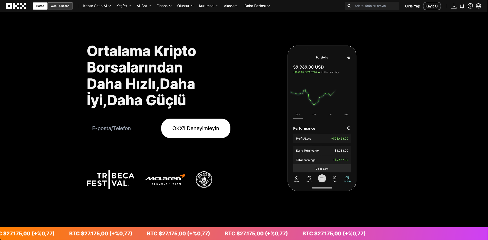

# OKX Homepage Clone

🔸 okx.com homepage clone  <br>
🔸 This web app built with using [Next.js](https://nextjs.org/). <br>
🔸 Click and see live demo... [Here](https://okx-clone-homepage.vercel.app/).

Firstly, You should fork/download repo to your github/pc after than
open the app with VS Code and follow the below commands...

## 💻 Setup <br>

### Install Dependencies

```
npm install
```

### Run the App in the Dev Server

```
npm run dev
```

### to Build for Production

```
npm run build
```

## 🔥 Technologies and Libraries <br>

✔️ Next.js<br>

## 🚀 App Features <br>

✔️ Tailwindcss, pure css and styled-components is used for css edits. <br>
✔️ gsap libary is used for advanced animation<br>
✔️ Optimistic UI<br>
✔️ All nav bar has animation.ss <br>

## 📷 Screenshot <hr>


<br>
